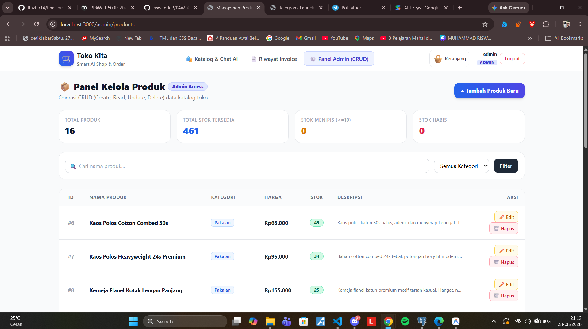
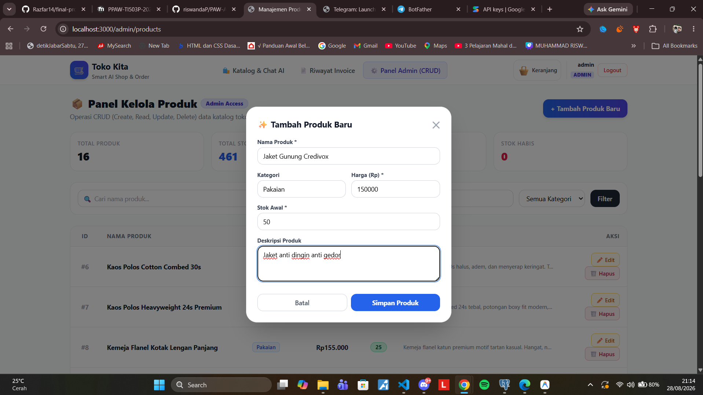
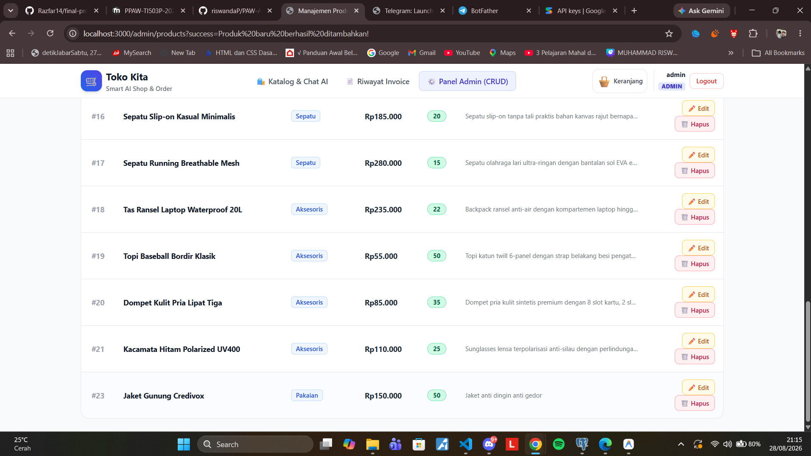
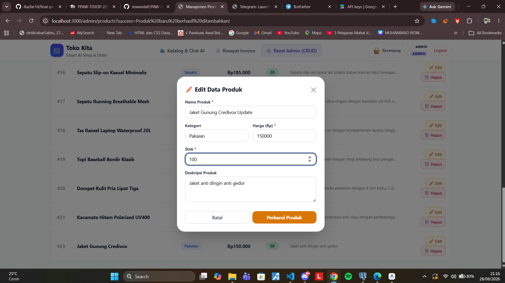
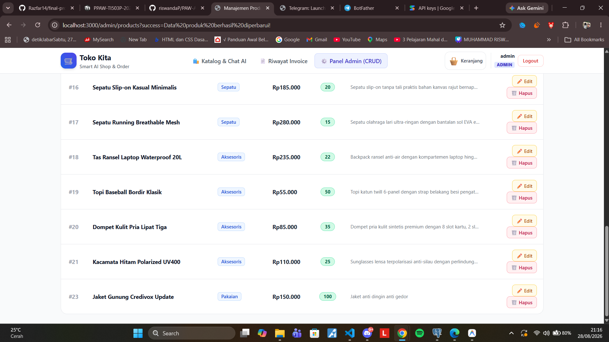
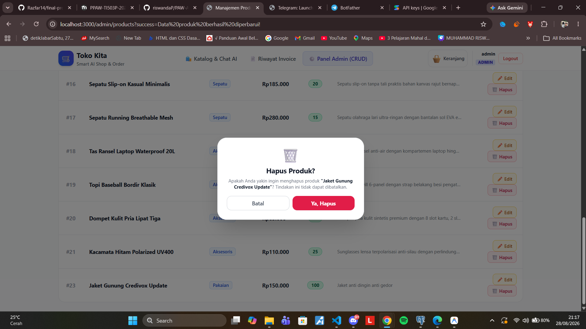
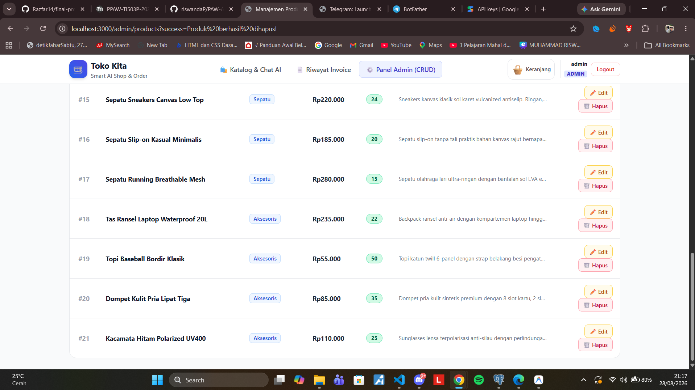
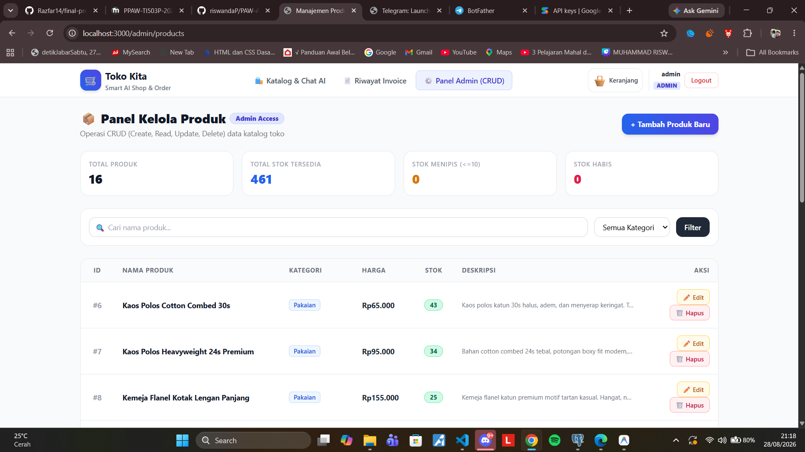
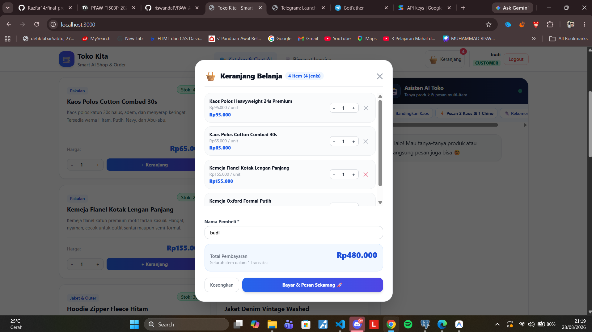
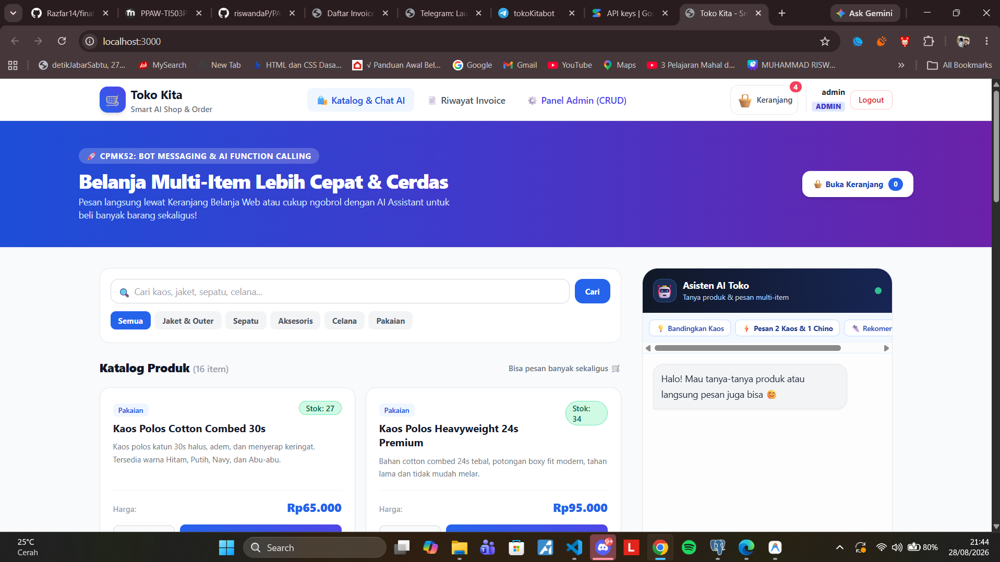

# Laporan Tugas Praktikum PAW — Pertemuan 13
**Materi:** Bot Messaging, Long Polling, Telegram Bot API, Function Calling AI, dan Reuse Logic (Prinsip DRY)  
**NIM:** 20240140021  
**Repository:** [PAW-ANTARA-WEEK13-20240140021](https://github.com/riswandaP/PAW-ANTARA-WEEK13-20240140021)  
**Tanggal Pengerjaan:** 28 Agustus 2026

---

## 📋 Ringkasan Implementasi & Konsep

Proyek ini merupakan pengembangan sistem toko online cerdas terintegrasi dengan **Telegram Bot (Long Polling)** dan **AI Assistant (Gemini Function Calling)** yang menerapkan prinsip **DRY (Don't Repeat Yourself)** secara konsisten di seluruh lapisan arsitektur.

### Fitur & Arsitektur Utama:
1. **Penerapan Prinsip DRY**:
   - `services/order.service.js`: Logika pembuatan pesanan (`createOrder`), validasi multi-item, pengurangan stok, dan notifikasi otomatis Telegram Bot hanya ditulis **satu kali** dan dipakai bersama oleh form Web Cart maupun Function Calling AI chat.
   - `services/product.service.js`: Query & format data produk dipakai bersama oleh Katalog Web, REST API (`/api/products`), Command Bot Telegram (`/stok`), dan System Instruction AI Gemini.
   - `middlewares/auth.middleware.js`: Autentikasi dan Role-Based Access Control (RBAC) reusable untuk membatasi hak akses role Admin dan Customer.
2. **Otentikasi 2 Role Pengguna**:
   - Role **Admin**: Akses panel manajemen CRUD produk, monitoring seluruh transaksi, dan pengubahan status pesanan.
   - Role **Customer**: Belanja multi-item melalui Keranjang Belanja / Chat AI, serta melihat riwayat pesanan milik akun sendiri.
3. **Multiple Order dalam 1 Transaksi**:
   - Mendukung checkout 2+ jenis produk sekaligus baik via antarmuka Web Cart maupun perintah percakapan AI natural.

---

## 🔑 Kredensial Akun Uji Coba

| Role | Username | Password | Hak Akses |
|---|---|---|---|
| **Admin** | `admin` | `admin123` | Akses Dashboard Admin (`/admin/products`), CRUD Produk, Kelola Status Invoice, Notifikasi Telegram |
| **Customer** | `budi` | `budi123` | Akses Katalog, Multi-Item Cart, Chat AI Assistant, Riwayat Pesanan Pribadi |
| **Customer** | `siti` | `siti123` | Akses Katalog, Multi-Item Cart, Chat AI Assistant, Riwayat Pesanan Pribadi |

---

## 📸 Bukti Pengerjaan Tugas (6 Poin Ketentuan)

---

### 1. Data Produk (Banyak Data Dummy)
Halaman katalog menampilkan lebih dari 15 data produk beragam dari berbagai kategori (Pakaian, Jaket & Outer, Celana, Sepatu, dan Aksesoris), membuktikan bahwa data tidak hanya terdiri dari 1-2 dummy.



> **Keterangan Bukti 1:** Halaman katalog toko menampilkan daftar 16 produk beragam dengan kategori, deskripsi lengkap, harga terformat rupiah, dan status stok yang dinamis.

---

### 2. CRUD Produk oleh Admin (Create, Read, Update, Delete)
Admin memiliki hak akses penuh untuk melakukan operasi CRUD terhadap data produk pada panel `/admin/products`.

#### A. Read & Overview Produk (Admin Panel)


> **Keterangan Bukti 2A:** Tampilan tabel manajemen produk pada dashboard admin lengkap dengan kartu statistik total produk, total stok, stok menipis, dan filter kategori.

#### B. Create Produk Baru (Before & After)



> **Keterangan Bukti 2B:** Proses penambahan produk baru *"Jaket Parka Waterproof"* melalui modal admin form dan bukti produk langsung tampil pada tabel katalog.

#### C. Update Data Produk (Before & After)



> **Keterangan Bukti 2C:** Proses pengeditan harga dan stok produk *"Kaos Polos Heavyweight 24s Premium"* melalui modal edit serta bukti pembaruan data berhasil disimpan.

#### D. Delete Produk



> **Keterangan Bukti 2D:** Modal konfirmasi penghapusan produk oleh admin dan bukti notifikasi sukses penghapusan produk dari database.

---

### 3. Login 2 Role Pengguna (Customer & Admin)
Sistem membedakan alur login dan tampilan antarmuka secara dinamis sesuai role pengguna yang terdaftar.

#### A. Login Berhasil Akun Customer


> **Keterangan Bukti 3A:** Pengguna masuk sebagai akun Customer (`budi`) dan diarahkan ke halaman katalog belanja dengan navigasi khusus customer dan riwayat invoice pribadinya.

#### B. Login Berhasil Akun Admin


> **Keterangan Bukti 3B:** Pengguna masuk sebagai akun Admin (`admin`) dan secara otomatis dialihkan ke Panel Kelola Produk (`/admin/products`) dengan badge role Admin.

---

### 4. Multiple Order dalam 1 Transaksi
Sistem mendukung pembelian lebih dari satu macam produk dalam satu kali pemesanan (multi-order), baik melalui Keranjang Belanja Web maupun instruksi natural via Chat AI Gemini.

#### A. Multiple Order melalui Keranjang Belanja Web (Cart Modal)


> **Keterangan Bukti 4A:** Proses checkout 2 jenis produk sekaligus (*Kaos Polos Cotton Combed 30s* sebanyak 2 unit dan *Celana Chino Slim Fit* sebanyak 1 unit) dalam satu transaksi keranjang belanja.

#### B. Multiple Order melalui Chat AI Assistant (Function Calling)


> **Keterangan Bukti 4B:** Percakapan dengan asisten AI di mana pengguna memesan 2 macam produk sekaligus, dan AI berhasil mengeksekusi function calling `buat_pesanan` untuk kedua produk tersebut.

#### C. Bukti Multi-Item Tersimpan di Invoice & Database


> **Keterangan Bukti 4C:** Faktur invoice membuktikan bahwa seluruh item produk yang dipesan tersimpan lengkap (bukan cuma 1 produk) beserta rincian kuantitas, harga satuan, dan subtotalnya.

---

### 5. Invoice & Ubah Status Pesanan oleh Admin
Admin dapat memeriksa rincian invoice setiap pesanan pelanggan serta mengubah status pesanan secara langsung.

#### A. Detail Faktur / Struk Invoice


> **Keterangan Bukti 5A:** Tampilan modal struk/invoice lengkap dengan nomor faktur, waktu pemesanan, nama pembeli, rincian produk, dan opsi cetak struk.

#### B. Pengubahan Status Pesanan oleh Admin (Before → After)


> **Keterangan Bukti 5B:** Admin mengubah status pesanan dari *"PENDING"* menjadi *"PROCESSING"* lalu *"COMPLETED"*, dan badge status pesanan langsung terupdate secara real-time.

---

### 6. Peningkatan Tampilan Antarmuka (UI/UX)
Tampilan antarmuka telah ditingkatkan menjadi lebih modern, responsif, dan rapi menggunakan Tailwind CSS.



> **Keterangan Bukti 6:** Antarmuka katalog modern dilengkapi hero banner, filter kategori interaktif, kartu produk informatif, floating cart dengan badge counter, dan widget chat AI cerdas.

---

## 🚀 Panduan Menjalankan Proyek

1. **Clone repository dan install dependensi:**
   ```bash
   git clone https://github.com/riswandaP/PAW-ANTARA-WEEK13-20240140021.git
   cd PAW-ANTARA-WEEK13-20240140021
   npm install
   ```

2. **Konfigurasi File `.env`:**
   Pastikan file `.env` sudah disesuaikan dengan database PostgreSQL Anda:
   ```env
   PORT=3000
   DB_HOST=localhost
   DB_PORT=5432
   DB_NAME=telegram_shop_db
   DB_USER=postgres
   DB_PASS=Nugraha03
   STORE_NAME=Toko Kita
   TELEGRAM_BOT_TOKEN=8876556504:AAEmVuGl0LeMaGel0BMzYDgSz35u5-nCb8g
   ADMIN_TELEGRAM_CHAT_ID=isi-chat-id-admin
   GEMINI_API_KEY=isi-api-key-gemini
   GEMINI_MODEL=gemini-3.6-flash
   ```

3. **Jalankan Seeder Database:**
   ```bash
   npm run seed
   ```

4. **Jalankan Server Aplikasi:**
   ```bash
   npm run dev
   ```
   Akses aplikasi pada peramban: [http://localhost:3000](http://localhost:3000)
